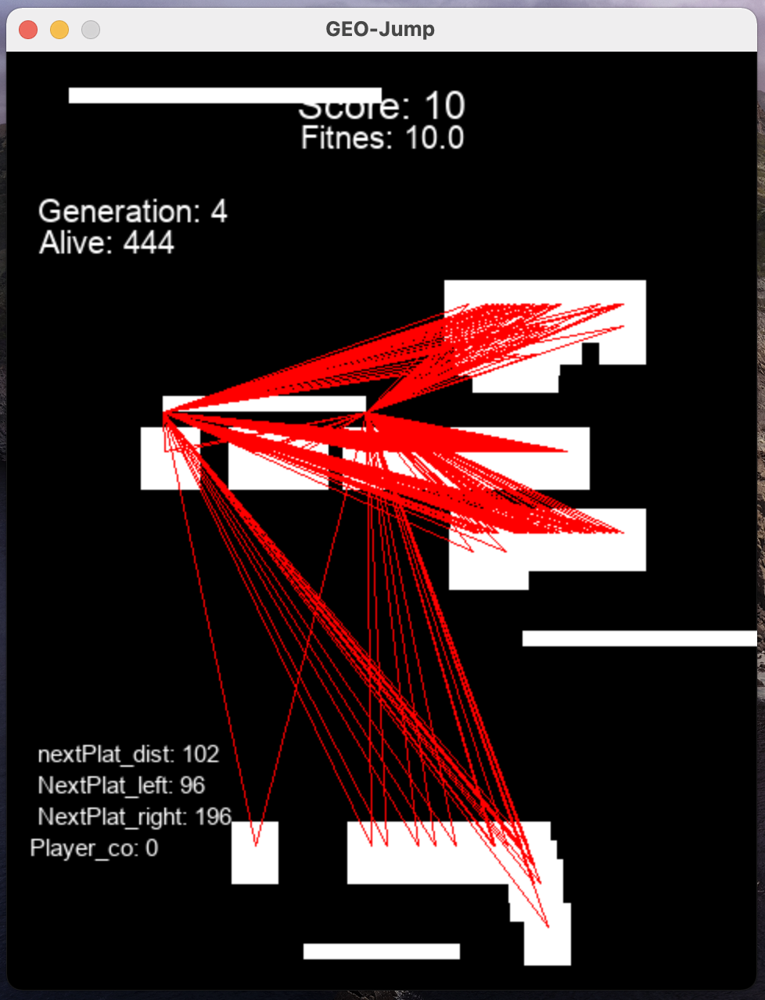

# NEAT-GEO-Jump
An AI that plays my Doodle Jump inspired jumping game! Using the NEAT python module.

# Instructions
Simply run main.py and watch an AI start training itself to play the game of GEO-Jump.

